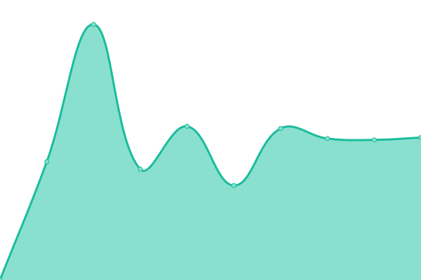

# [📈 Live Status](https://marci4server.github.io/uptime): <!--live status--> **🟧 Partial outage**

This repository contains the open-source uptime monitor and status page for [marci4server](https://marci4server.github.io/uptime), powered by [Upptime](https://github.com/upptime/upptime).

With [Upptime](https://upptime.js.org), you can get your own unlimited and free uptime monitor and status page, powered entirely by a GitHub repository. We use [Issues](https://github.com/marci4server/uptime/issues) as incident reports, [Actions](https://github.com/marci4server/uptime/actions) as uptime monitors, and [Pages](https://marci4server.github.io/uptime) for the status page.

<!--start: status pages-->
<!-- This summary is generated by Upptime (https://github.com/upptime/upptime) -->
<!-- Do not edit this manually, your changes will be overwritten -->
<!-- prettier-ignore -->
| URL | Status | History | Response Time | Uptime |
| --- | ------ | ------- | ------------- | ------ |
|  [marci4.de](https://marci4.de) | 🟩 Up | [marci4-de.yml](https://github.com/marci4server/uptime/commits/HEAD/history/marci4-de.yml) | 

 1278ms
     
 | 

<a href="https://marci4server.github.io/uptime/history/marci4-de">100.00%</a>
    

|  VirtualMin | 🟩 Up | [virtual-min.yml](https://github.com/marci4server/uptime/commits/HEAD/history/virtual-min.yml) | 

 1836ms
     
 | 

<a href="https://marci4server.github.io/uptime/history/virtual-min">100.00%</a>
    

|  Webmail | 🟩 Up | [webmail.yml](https://github.com/marci4server/uptime/commits/HEAD/history/webmail.yml) | 

 696ms
     
 | 

<a href="https://marci4server.github.io/uptime/history/webmail">100.00%</a>
    

|  Nextcloud | 🟩 Up | [nextcloud.yml](https://github.com/marci4server/uptime/commits/HEAD/history/nextcloud.yml) | 

 1227ms
     
 | 

<a href="https://marci4server.github.io/uptime/history/nextcloud">100.00%</a>
    

|  Portainer | 🟩 Up | [portainer.yml](https://github.com/marci4server/uptime/commits/HEAD/history/portainer.yml) | 

 607ms
     
 | 

<a href="https://marci4server.github.io/uptime/history/portainer">100.00%</a>
    

|  Rspamd | 🟩 Up | [rspamd.yml](https://github.com/marci4server/uptime/commits/HEAD/history/rspamd.yml) | 

 546ms
     
 | 

<a href="https://marci4server.github.io/uptime/history/rspamd">100.00%</a>
    

|  Addons | 🟩 Up | [addons.yml](https://github.com/marci4server/uptime/commits/HEAD/history/addons.yml) | 

 488ms
     
 | 

<a href="https://marci4server.github.io/uptime/history/addons">100.00%</a>
    

|  [feuerwehr-lauben.de](https://feuerwehr-lauben.de) | 🟩 Up | [feuerwehr-lauben-de.yml](https://github.com/marci4server/uptime/commits/HEAD/history/feuerwehr-lauben-de.yml) | 

 1866ms
     
 | 

<a href="https://marci4server.github.io/uptime/history/feuerwehr-lauben-de">100.00%</a>
    

|  [kljb-lauben.de](https://kljb-lauben.de) | 🟩 Up | [kljb-lauben-de.yml](https://github.com/marci4server/uptime/commits/HEAD/history/kljb-lauben-de.yml) | 

 702ms
     
 | 

<a href="https://marci4server.github.io/uptime/history/kljb-lauben-de">100.00%</a>
    

|  [elektro-oppold.de](https://elektro-oppold.de) | 🟩 Up | [elektro-oppold-de.yml](https://github.com/marci4server/uptime/commits/HEAD/history/elektro-oppold-de.yml) | 

 741ms
     
 | 

<a href="https://marci4server.github.io/uptime/history/elektro-oppold-de">100.00%</a>
    

|  [faschingsverein-oy.de](https://faschingsverein-oy.de) | 🟩 Up | [faschingsverein-oy-de.yml](https://github.com/marci4server/uptime/commits/HEAD/history/faschingsverein-oy-de.yml) | 

 1239ms
     
 | 

<a href="https://marci4server.github.io/uptime/history/faschingsverein-oy-de">100.00%</a>
    

|  [saegesucht.de](https://saegesucht.de) | 🟩 Up | [saegesucht-de.yml](https://github.com/marci4server/uptime/commits/HEAD/history/saegesucht-de.yml) | 

 1043ms
     
 | 

<a href="https://marci4server.github.io/uptime/history/saegesucht-de">100.00%</a>
    

|  [sw-vt.de](https://sw-vt.de/) | 🟩 Up | [sw-vt-de.yml](https://github.com/marci4server/uptime/commits/HEAD/history/sw-vt-de.yml) | 

 1450ms
     
 | 

<a href="https://marci4server.github.io/uptime/history/sw-vt-de">100.00%</a>
    

|  [prinzessin-gugelhupf.de](https://prinzessin-gugelhupf.de/) | 🟩 Up | [prinzessin-gugelhupf-de.yml](https://github.com/marci4server/uptime/commits/HEAD/history/prinzessin-gugelhupf-de.yml) | 

 1075ms
     
 | 

<a href="https://marci4server.github.io/uptime/history/prinzessin-gugelhupf-de">100.00%</a>
    

|  [mg-naturgartenbau.de](http://mg-naturgartenbau.de) | 🟥 Down | [mg-naturgartenbau-de.yml](https://github.com/marci4server/uptime/commits/HEAD/history/mg-naturgartenbau-de.yml) | 

 0ms
     
 | 

<a href="https://marci4server.github.io/uptime/history/mg-naturgartenbau-de">0.00%</a>
    

|  [Birkenmoos.de](https://birkenmoos.de) | 🟩 Up | [birkenmoos-de.yml](https://github.com/marci4server/uptime/commits/HEAD/history/birkenmoos-de.yml) | 

 2133ms
     
 | 

<a href="https://marci4server.github.io/uptime/history/birkenmoos-de">28.54%</a>
    

<!--end: status pages-->

[**Visit our status website →**](https://marci4server.github.io/uptime)

## 📄 License

- Powered by: [Upptime](https://github.com/upptime/upptime)
- Code: [MIT](./LICENSE) © [marci4server](https://marci4server.github.io/uptime)
- Data in the `./history` directory: [Open Database License](https://opendatacommons.org/licenses/odbl/1-0/)
